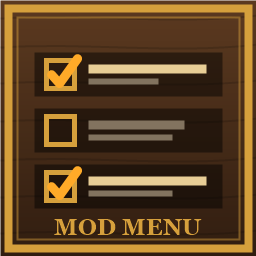

# Mod Menu for Valheim



A **Mods** button in Valheim's main menu: manage every installed mod without leaving the game.

| | |
|---|---|
| **Download** | [Releases](https://github.com/Dismonder/ModMenu/releases/latest) · [Thunderstore (r2modman)](https://thunderstore.io/c/valheim/p/Dismonder/ModMenu/) |
| Changelog | [CHANGELOG.md](mods/ModMenu/Package/CHANGELOG.md) |
| Requires | Valheim 1.0.x, [BepInEx 5](https://thunderstore.io/c/valheim/p/denikson/BepInExPack_Valheim/), [Jotunn](https://thunderstore.io/c/valheim/p/ValheimModding/Jotunn/) |

## Features

- **Switch mods on and off** with a checkbox. Nothing is renamed or moved, so Vortex, r2modman and Thunderstore installs
  stay intact: a small BepInEx patcher (`BepInEx/patchers/ModMenu`) simply does not load the mods you switched off.
  Changes apply after a restart - the *Restart game* button does it for you (Steam, other launchers, Linux).
- **Edit every mod's settings** in a window: toggles, dropdowns, sliders and text fields, saved at once, with a *Default*
  button per setting. Every config file a mod uses is found, big mods get foldable sections and a search box, and the
  usual ConfigurationManager tags (Browsable, ReadOnly, Order, DispName, Category, IsAdvanced) are honoured.
- **Profiles**: save which mods are off (e.g. "co-op" and "solo") and switch in one click.
- **Update check** against Nexus Mods (Vortex and hand installs) and Thunderstore. No account or API key needed.
  Nothing is downloaded; the *Page* button opens the mod's page.
- **Ctrl+M** opens the menu too (`General/OpenKey`), handy when another mod reworks the main menu. Gamepad B closes it.
- English and Polish (follows the game's language). Client-side only: other players and the server do not need it.

Mod Menu and Jotunn cannot be switched off from the menu (you would lose the menu). If the game does not start after
switching a mod off, delete `BepInEx/config/ModMenu/disabled.txt` and every mod loads again.

## Install

- **r2modman / Thunderstore Mod Manager:** search for *ModMenu* by Dismonder.
- **By hand:** unpack the release zip into `Valheim/BepInEx/` so that `plugins/ModMenu` ends up in `BepInEx/plugins`
  and `patchers/ModMenu` in `BepInEx/patchers`.

## Build

.NET SDK 8+ and an installed Valheim with BepInEx and Jotunn (game DLLs are referenced from the install; set
`VALHEIM_DIR` if it is not in the default Steam folder).

```
dotnet build mods/ModMenu              # builds and copies to BepInEx/plugins/ModMenu
dotnet build mods/ModMenu.Patcher      # builds and copies to BepInEx/patchers/ModMenu
dotnet test tests/ModMenu.Tests
pwsh tools/package.ps1 ModMenu         # Thunderstore zip in dist/
```

---

## Po polsku

Przycisk **Mody** w menu głównym Valheim: włączanie i wyłączanie modów bez ruszania plików (działa z Vortexem
i r2modman), ustawienia każdego moda w wygodnym oknie, profile modów i sprawdzanie aktualizacji (Nexus, Thunderstore).
**Ctrl+M** też otwiera menu. Instalacja: rozpakuj zip z [Wydań](https://github.com/Dismonder/ModMenu/releases/latest)
do `Valheim/BepInEx/` albo zainstaluj przez r2modman. Gdyby gra nie wstała po wyłączeniu jakiegoś moda, usuń
`BepInEx/config/ModMenu/disabled.txt`.

Made by the author of [Age of Jarls](https://github.com/Dismonder/AgeOfJarls).
